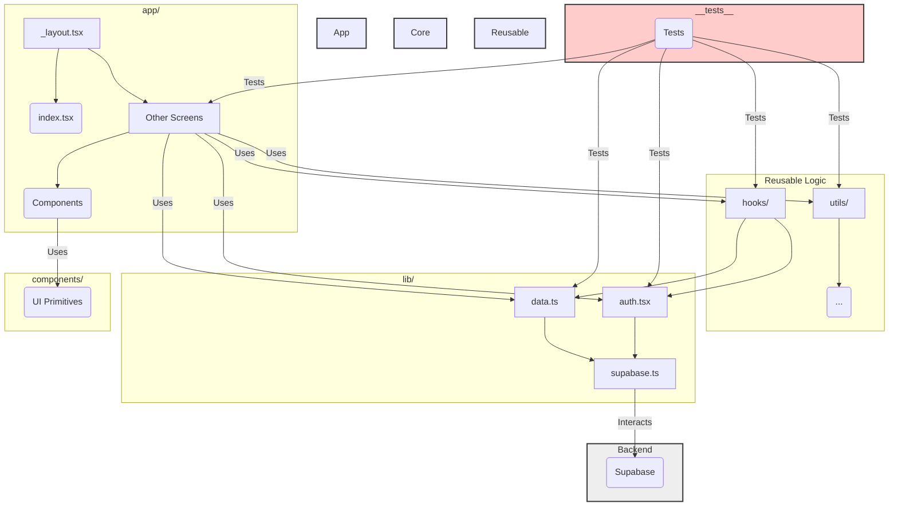

# Codebase Assessment Plan: RefreshLawn App

**Goal:** Assess Code Quality, Maintainability, Performance, Architectural Concerns, and Testing based on the provided codebase, and provide actionable recommendations.

**Source:** Analysis will be performed on the codebase provided in the Repomix file.

---

## Phase 1: Initial Scan & Structure Analysis
**Depth:** Quick Check
*   **Action:** Analyze the directory structure provided in the Repomix file (`app/`, `lib/`, `components/`, `hooks/`, `utils/`, `__tests__/`, `supabase/`).
*   **Purpose:** Understand the high-level file structure and organization.
*   **Action:** Check `package.json` for linting scripts (`npm run lint`).
*   **Purpose:** Note available static analysis tools.

---

## Phase 2: Code Quality & Architecture Review
**Depth:** In-depth Analysis
*   **Action:** Analyze key configuration files (`tsconfig.json`, `tailwind.config.js`, `app.config.js`, `metro.config.js`, `babel.config.js`).
*   **Purpose:** Understand project setup, build configurations, type safety, and styling approach.
*   **Action:** Analyze core logic files (`lib/supabase.ts`, `lib/auth.tsx`, `lib/data.ts`).
*   **Purpose:** Evaluate Supabase integration, authentication flow, data fetching patterns, and core business logic clarity.
*   **Action:** Analyze representative screen/component files from `app/` and `components/`.
*   **Purpose:** Assess component structure, state management, adherence to UI patterns (NativeWind), routing (Expo Router), and maintainability.
*   **Action:** Analyze custom hooks (`hooks/`) and utility files (`utils/`).
*   **Purpose:** Evaluate reusable logic, clarity, and separation of concerns.
*   **Architectural Assessment:**
    *   Evaluate overall architecture: clarity, separation of concerns (business logic vs. UI), modularity.
    *   Assess the suitability of the tech stack (Expo Router, Supabase, NativeWind) for current and foreseeable needs.
    *   Evaluate adherence to best practices (TypeScript, React Native, chosen patterns).
    *   Identify potential code smells (long functions/components, complexity, commented-out code).
*   **Mermaid Visualization:** Provide a high-level diagram showing component/module relationships and data flow if beneficial.

---

## Phase 3: Performance Assessment (Static)
**Depth:** Detailed Checks (Static Analysis)
*   **Data Fetching (`lib/data.ts` & usage):**
    *   Evaluate efficiency (potential for N+1, missing pagination/caching, fetching unnecessary data).
*   **Rendering Performance (`app/`, `components/`):**
    *   Identify potentially problematic rendering patterns (e.g., large lists without virtualization like `FlatList`/`FlashList`, potential for excessive re-renders).
    *   Check for appropriate use of optimization hooks (`React.memo`, `useCallback`, `useMemo`).
    *   Briefly assess for common patterns that might lead to memory leaks (e.g., uncleared intervals/timeouts in `useEffect`, incorrect dependency arrays).

---

## Phase 4: Testing Assessment
**Depth:** Moderate Analysis
*   **Configurations (`jest.config.js`, `jest.setup.js`):**
    *   Evaluate test environment setup.
*   **Test Analysis (`__tests__/`):**
    *   Review test structure, clarity, and types (unit, integration?).
    *   Identify apparent gaps in test coverage based on project structure and existing tests.

---

## Phase 5: Synthesis, Recommendations & Reporting
**Depth:** In-depth Analysis
*   **Findings Summary:** Organize and categorize findings (Code Quality, Performance, Architecture, Testing).
*   **Actionable Recommendations:** Provide specific examples and explicit recommendations for each issue, suggesting priorities (immediate vs. long-term).
*   **Report Delivery:** Structure the final report clearly for readability and easy reference.

---

## Optional (Recommended) Additions:

*   **Brief Security Check:**
    *   **Depth:** Quick Check
    *   Quickly review authentication/security practices in `lib/auth.tsx`, `lib/supabase.ts`, and relevant Supabase RLS policies/functions if present in the `supabase/` directory.
*   **Scalability Assessment:**
    *   **Depth:** Quick Check
    *   Briefly assess the current design for scalability concerns (e.g., modularity, ease of extending functionality).

---